# QDMS Lite Showcase

QDMS Lite, kurum içi doküman süreçlerini yönetmek için geliştirilmiş hafif ve modüler bir doküman yönetim sistemi arayüzüdür.

Bu repository, projenin kaynak kodunu değil; geliştirilen uygulamanın ekran görüntüleri, modül yapısı ve genel ürün akışını göstermek amacıyla hazırlanmıştır.

> Source code is private. This repository is a showcase/demo repository.

---

## Genel Bakış

QDMS Lite; doküman oluşturma, yayınlama, revizyon, onay akışı, kullanıcı yetkilendirme, şablon yönetimi ve denetim kayıtları gibi temel kurumsal doküman yönetimi süreçlerini destekleyen bir web uygulamasıdır.

Proje, gerçek kurum içi doküman süreçlerinden yola çıkarak sade, anlaşılır ve rol bazlı kullanılabilir bir yapı hedeflenerek geliştirilmiştir.

---

## Öne Çıkan Özellikler

- Doküman listeleme, arama ve gelişmiş filtreleme
- Doküman detay sayfası ve versiyon bilgisi takibi
- Online doküman görüntüleme
- Çok adımlı doküman hazırlama akışı
- Dosya yükleyerek veya şablondan doküman oluşturma
- Onay, revizyona gönderme ve reddetme işlemleri
- Doküman revizyon yönetimi
- Kullanıcıya görev atama ve görev takibi
- Doküman şablonu oluşturma ve versiyonlama
- Uygulama yeri / organizasyon birimi yönetimi
- Rol bazlı kullanıcı erişim yönetimi
- Onay akışı tanımlama
- Güvenlik ve denetim kayıtları

---

## Ekran Görüntüleri

### Dashboard

Bekleyen işlem özetleri ve kullanıcıya ait aksiyon kartları.

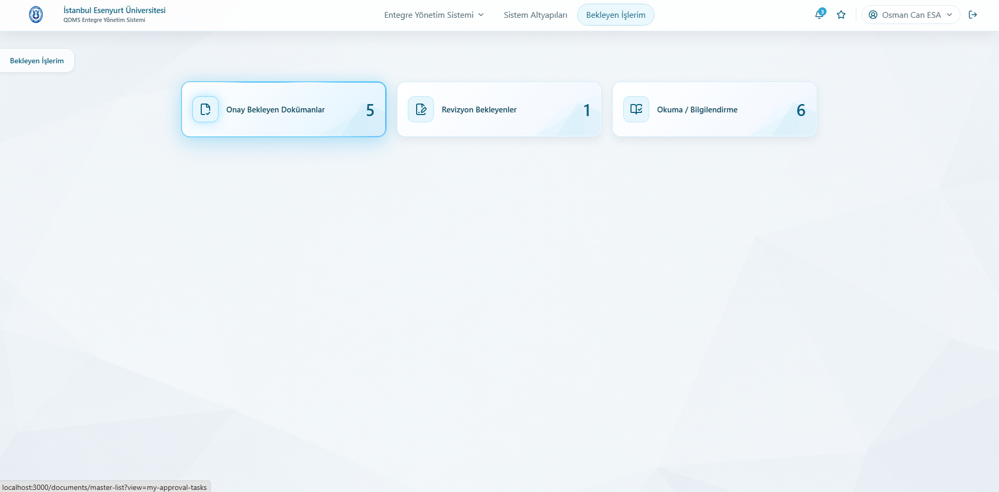

---

### Menü ve Modül Yapısı

Doküman yönetimi, sistem altyapıları ve bekleyen işler için üst menü yapısı.

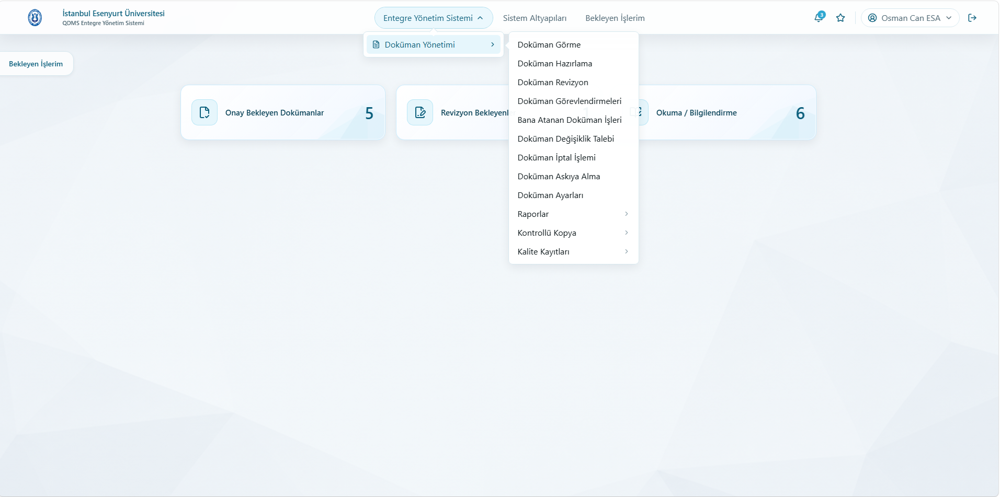

---

### Doküman Listeleme ve Filtreleme

Doküman kodu, başlık, durum, tür, tarih, klasör ve okuma durumu gibi alanlara göre filtreleme yapılabilir.

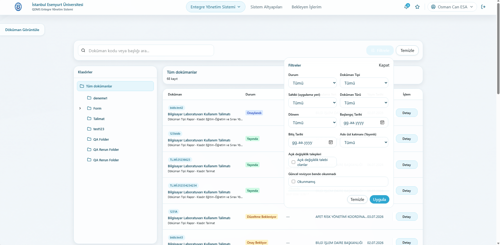

---

### Online Doküman Görüntüleme

Dokümanlar sistem içerisinde salt okunur olarak görüntülenebilir.

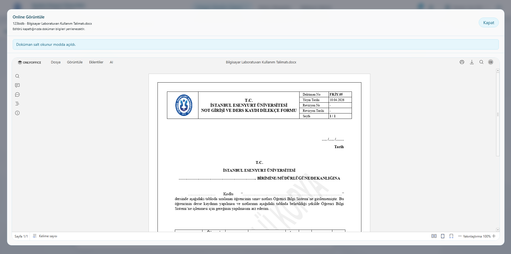

---

### Doküman Detayı

Dokümana ait genel bilgiler, yayın/versiyon bilgileri ve okuma durumu tek ekranda takip edilebilir.

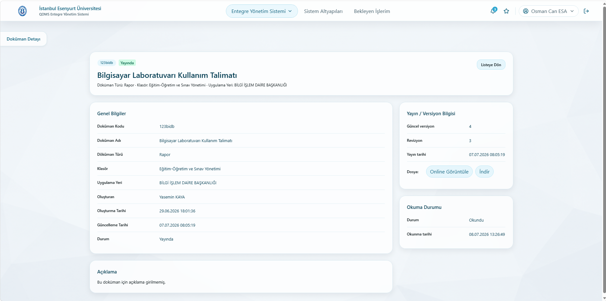

---

### Doküman Hazırlama Akışı

Doküman hazırlama süreci adım adım ilerleyen bir yapı ile tasarlanmıştır.

#### 1. Doküman Bilgileri

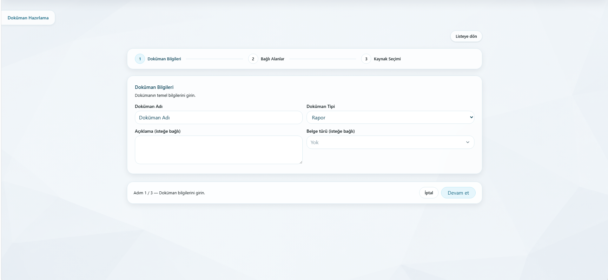

#### 2. Bağlı Alanlar

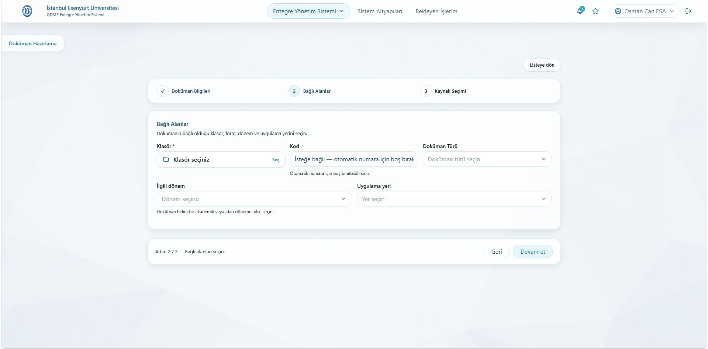

#### 3. Kaynak Seçimi

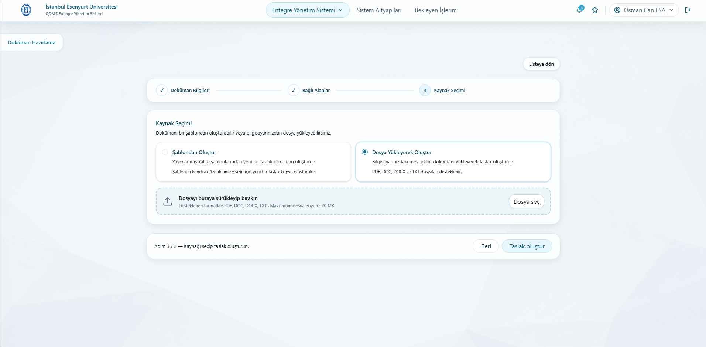

---

### Taslak ve Onay Süreci

Taslak dokümanlar düzenlenebilir, silinebilir veya onay akışına alınabilir.

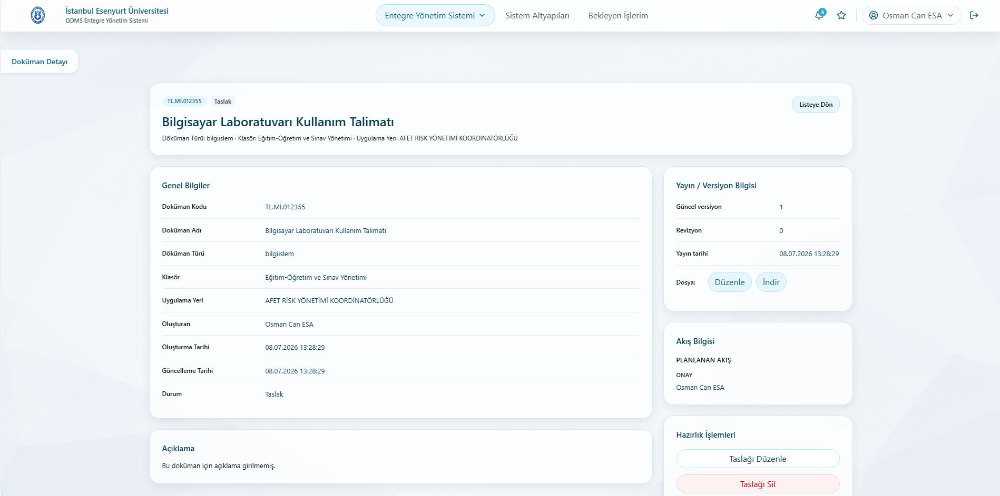

Onay bekleyen dokümanlarda onaylama, revizyona gönderme ve reddetme işlemleri yapılabilir.

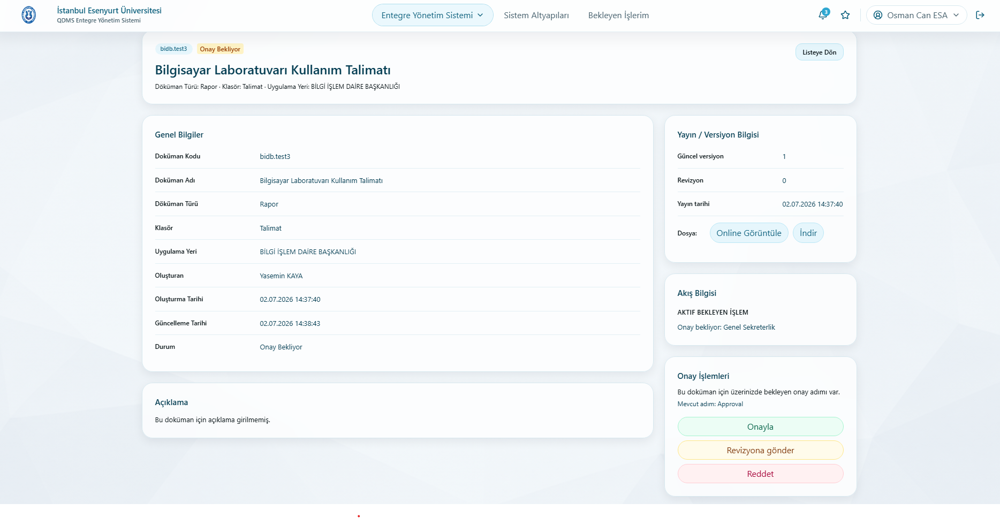

---

### Revizyon Yönetimi

Yayındaki dokümanlar için revizyon başlatılabilir ve revizyon gerekçesi takip edilebilir.

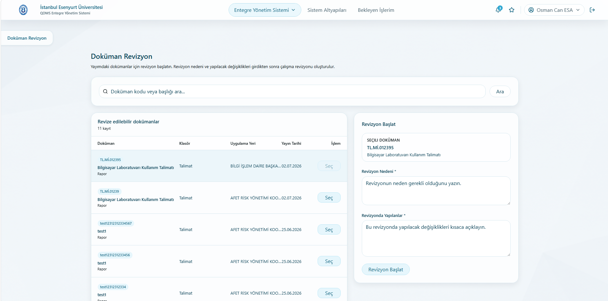

---

### Görevlendirme

Yöneticiler kullanıcılara doküman hazırlama veya revizyon görevleri atayabilir.

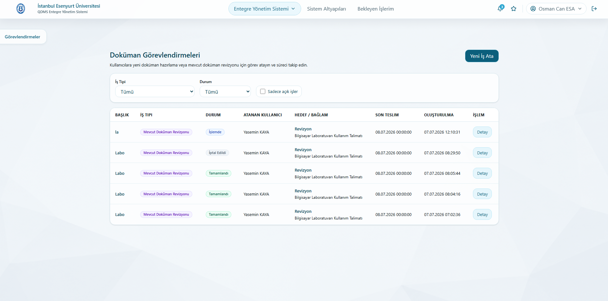

Kullanıcılar kendilerine atanan işleri ayrı bir görev ekranından takip edebilir.

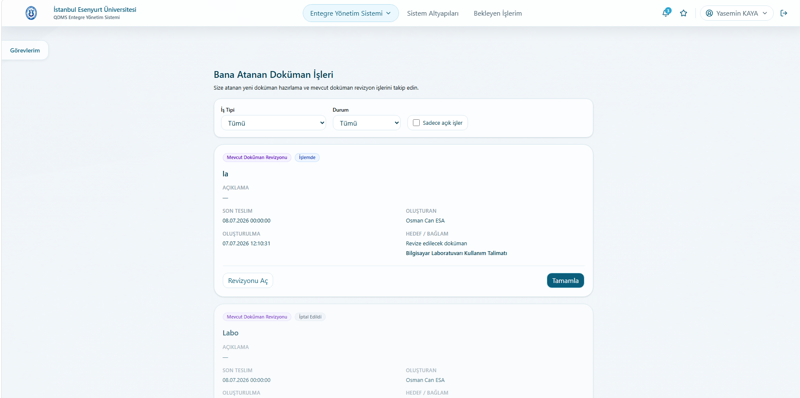

---

### Şablon Yönetimi

Doküman şablonları listelenebilir, detayları görüntülenebilir ve versiyonları takip edilebilir.

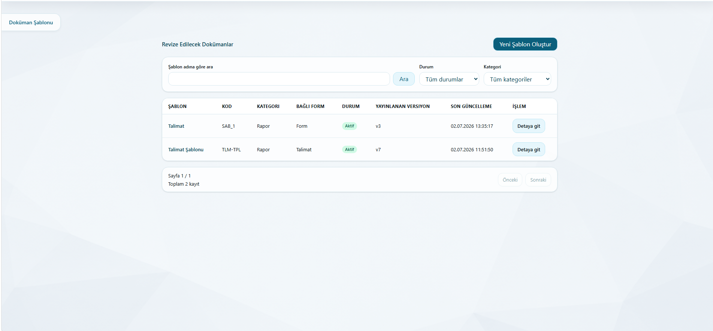

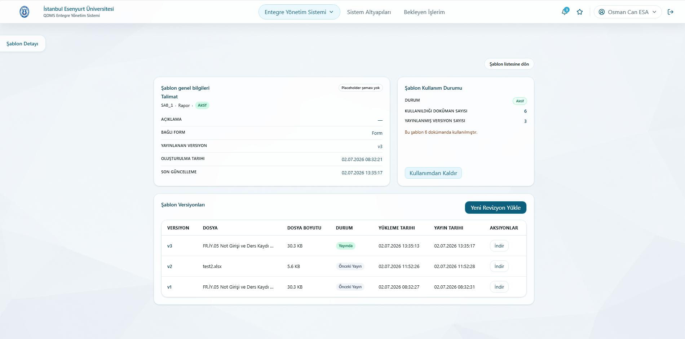

---

### Sistem Altyapıları

Organizasyon birimleri, kullanıcı erişimleri ve onay akışları yönetilebilir.

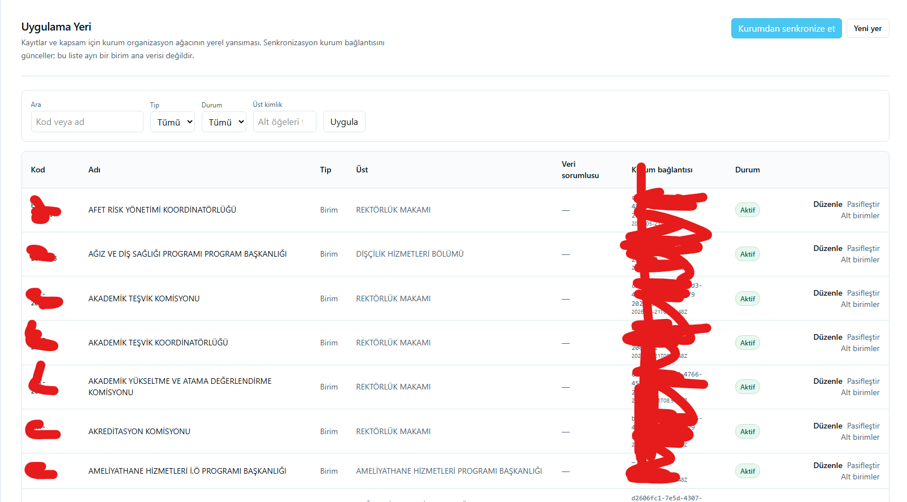

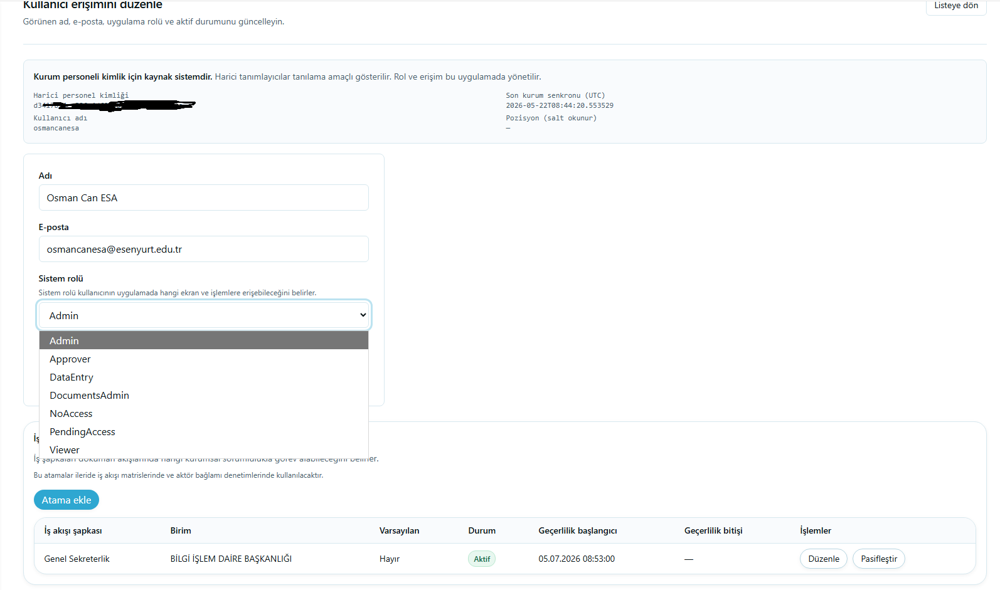

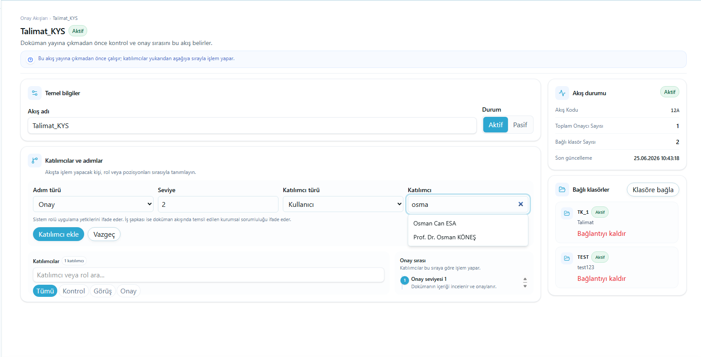

---

### Denetim Kayıtları

Güvenlik açısından kritik işlemler denetim kayıtları üzerinden takip edilebilir.

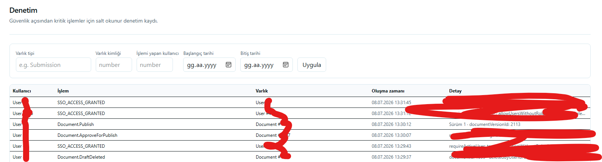

---

## Kullanılan Teknolojiler

> Bu alanı paylaşmak istediğin teknik detaylara göre güncelle.

- Frontend: react.js
- Backend: c# .net 9
- Database: Mssql
- Authentication / Authorization: Kendi SSO katmanım
- Document Viewer: OnlyOffice Docker
- Deployment: Docker

---

## Projedeki Rolüm

Bu projede uçtan uca geliştirme sürecinde görev aldım:

- Kullanıcı arayüzü tasarımı ve geliştirme
- Doküman süreçlerinin modellenmesi
- Onay ve revizyon akışlarının kurgulanması
- Rol bazlı erişim yapısının hazırlanması
- Listeleme, filtreleme ve detay ekranlarının geliştirilmesi
- Denetim ve işlem kayıtlarının arayüzde sunulması

---

## Not

Bu repository yalnızca portfolyo ve ürün tanıtımı amacıyla hazırlanmıştır. Kaynak kod, kurum içi iş kuralları ve hassas teknik detaylar paylaşılmamaktadır.

---

## License / Usage

This repository is for showcase purposes only.  
All rights reserved.